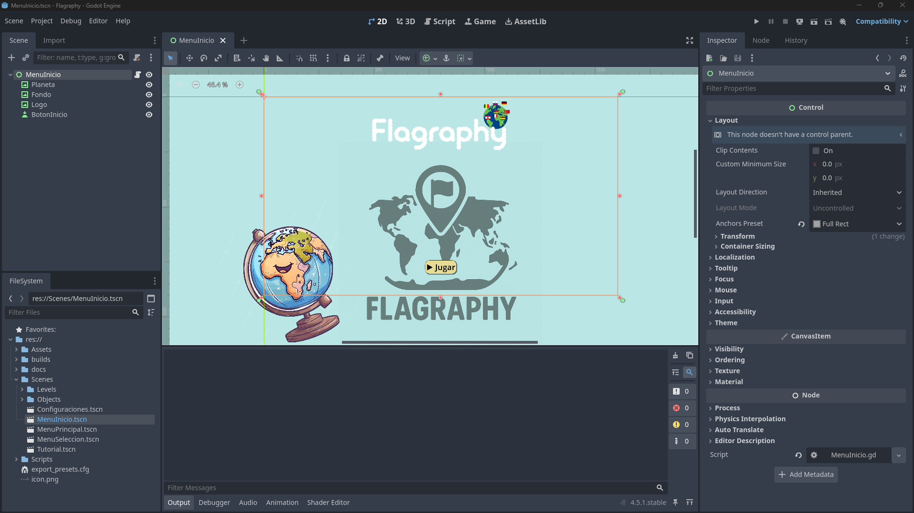
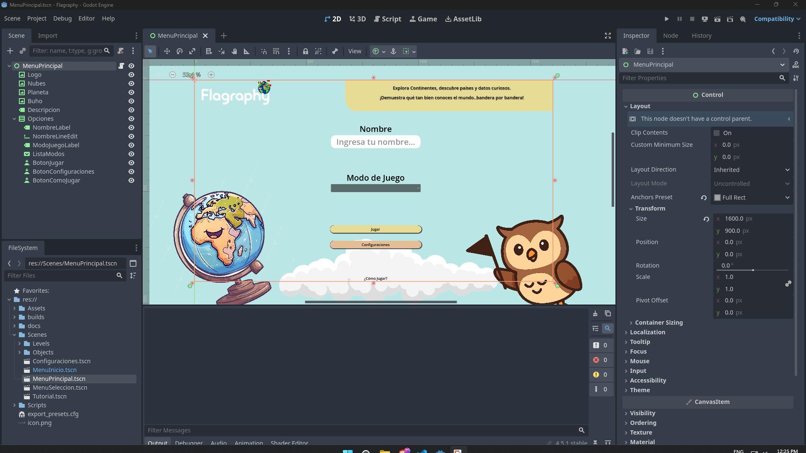
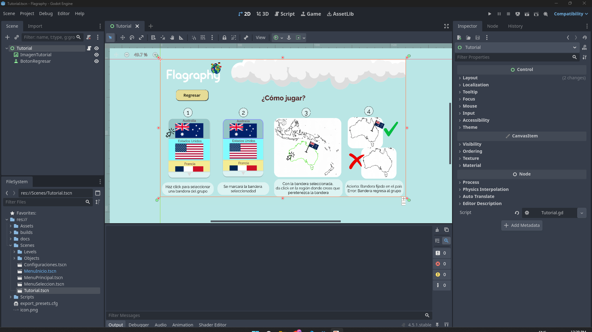
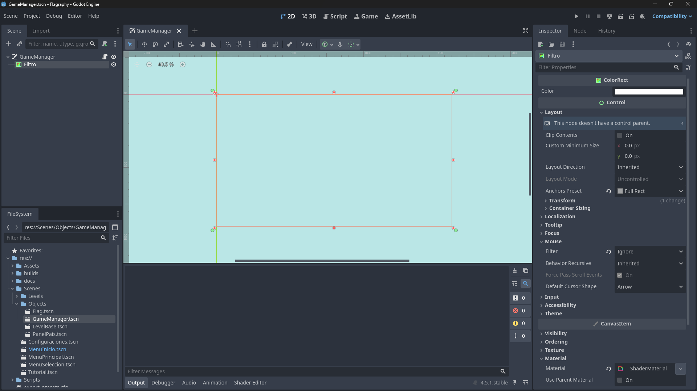
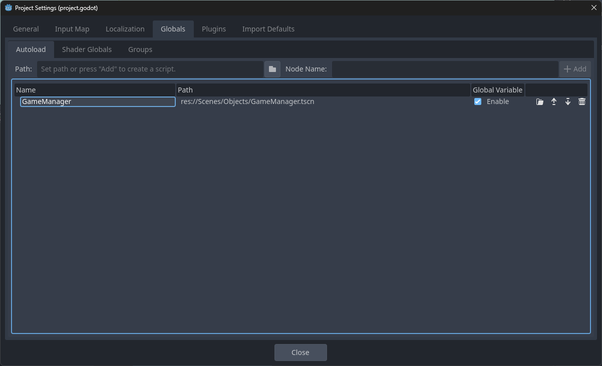
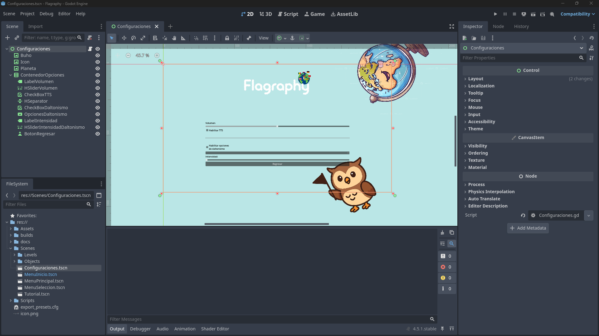
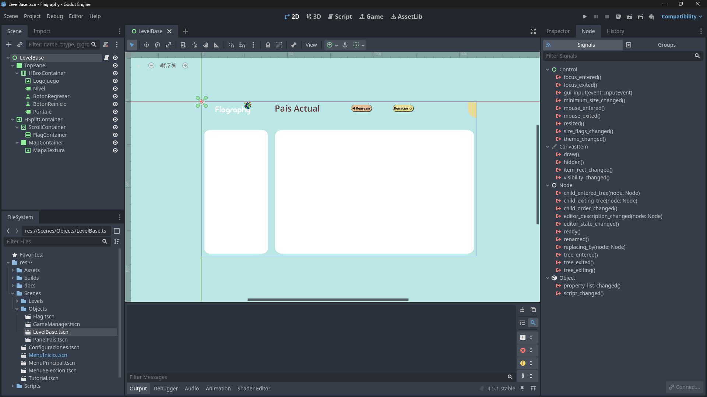
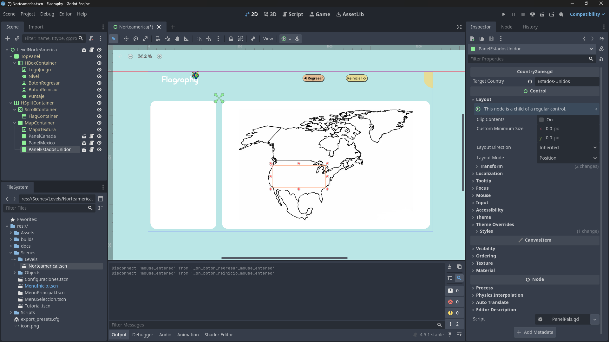

# Arquitectura de Flagraphy

## Configuracion de Carpetas.

```
Flagraphy/
├──Assets/
|   ├──Banderas/
|   |   └──Norte America/   #Imagenes de las banderas de Norte America
|   ├──Estilos/
|   |   └──Botones/         #Contiene los estilos de los botones
|   ├──Mapas/               #Imagenes de los mapas
|   ├──Misc/                #Recursos generales (planeta.png, buho.png, etc)
|   └──Shaders/
|       └──ColorBlind.gdshader  #Shader que aplica filtros de daltonismo al lo largo del proyecto
├──Scenes/
|   ├── Levels/             #Contiene las escenas de los niveles (Norteamerica.tscn)
|   |   └──Norteamerica.tscn
|   ├── Objects/            #No son escenas como tal, sino objetos que se utiliza para la construccion de las escenas del juego en sí
|   |   ├──Flag.tscn        #Objeto Bandera
|   |   ├──GameManager.tscn #Manager del juego que controla las configuraciones de forma global
|   |   ├──LevelBase.tscn   #Plantilla del las escenas de Levels/
|   |   └──PanelPais.tscn   #Panel en el cual se pone las banderas donde corresponden dentro del mapa
|   ├──Configuraciones.tscn #Escena de configuraciones del juego
|   ├──MenuInicio.tscn      #Menu de Inicio (Donde empieza todo el juego)
|   ├──MenuPrincipal.tscn   #Menu Principal (Despues de menu de inicio)
|   ├──MenuSeleccion.tscn   #Menu donde se selecciona el continente del juego
|   └──Tutorial.tscn        #Se muestra el tutorial del juego
└──Scripts/                 #Scripts que controlan la logica del juego.
```

## Configuracion de las escenas
### MenuInicio


Todas las escenas esta compuestas de un nodo de tipo control.

#### Script MenuInicio.gd

```godot
extends Control

var escena_menu_principal = "res://Scenes/MenuPrincipal.tscn" 
@onready var boton_inicio: Button = $BotonInicio

func _ready() -> void:
	boton_inicio.pressed.connect(cambiar_escena_menu_principal)

func cambiar_escena_menu_principal():
	# Esta función cambia la escena actual por la nueva y borra la anterior de la memoria
	get_tree().change_scene_to_file(escena_menu_principal)
```
### MenuPrincipal


#### Script MenuPrincipal.gd
```
extends Control

@onready var nombre_line_edit: LineEdit = $Opciones/NombreLineEdit
@onready var lista_modos: OptionButton = $Opciones/ListaModos
@onready var boton_jugar: Button = $Opciones/BotonJugar
@onready var boton_configuraciones: Button = $Opciones/BotonConfiguraciones
@onready var boton_como_jugar: Button = $Opciones/BotonComoJugar

var escena_tutorial = "res://Scenes/Tutorial.tscn"
var escena_configuraciones = "res://Scenes/Configuraciones.tscn"
var escena_seleccion_nivel_pais = "res://Scenes/MenuSeleccion.tscn"

func _ready() -> void:
	boton_como_jugar.pressed.connect(cambiar_escena_tutorial)
	boton_configuraciones.pressed.connect(cambiar_escena_configuraciones)
	boton_jugar.pressed.connect(cambiar_escena_juego)

func cambiar_escena_tutorial():
	get_tree().change_scene_to_file(escena_tutorial)

func cambiar_escena_configuraciones():
	get_tree().change_scene_to_file(escena_configuraciones)

func cambiar_escena_juego():
	if lista_modos.selected == 0:
		get_tree().change_scene_to_file(escena_seleccion_nivel_pais)
	elif lista_modos.selected == 1:
		get_tree().change_scene_to_file(escena_configuraciones) #TODO: Desarrollar nivel global
```
## Tutorial


### Script Tutorial.gd
```
extends Control

@onready var boton_regresar: Button = $BotonRegresar

var escena_menu_principal = "res://Scenes/MenuPrincipal.tscn"

func _ready() -> void:
	boton_regresar.pressed.connect(cambiar_escena_menu_principal)

func cambiar_escena_menu_principal():
	get_tree().change_scene_to_file(escena_menu_principal)
```

## Game Manager y Configuraciones


Game Manager es una escena de tipo CanvasLayer, dentro de esta escena, se instancia un ColorRect que nos sirve de filtro para daltonismo. Este efecto se la aplica como material al Filtro (ColorRect) el shader ColorBlind.gdshader

```glsl
shader_type canvas_item;

uniform sampler2D screen_texture : hint_screen_texture, filter_nearest;
uniform int mode : hint_range(0, 3) = 0; // 0:Normal, 1:Prota, 2:Deuta, 3:Trita
uniform float intensity : hint_range(0.0, 1.0) = 1.0;

void fragment() {
	vec4 c = texture(screen_texture, SCREEN_UV);
	
	// Matrices aproximadas para simulación de daltonismo (LMS version simplificada)
	// Protanopia (Rojo debil)
	mat3 prota = mat3(
		vec3(0.567, 0.433, 0.0),
		vec3(0.558, 0.442, 0.0),
		vec3(0.0, 0.242, 0.758)
	);
	
	// Deuteranopia (Verde debil)
	mat3 deuta = mat3(
		vec3(0.625, 0.375, 0.0),
		vec3(0.7, 0.3, 0.0),
		vec3(0.0, 0.3, 0.7)
	);
	
	// Tritanopia (Azul debil)
	mat3 trita = mat3(
		vec3(0.95, 0.05, 0.0),
		vec3(0.0, 0.433, 0.567),
		vec3(0.0, 0.475, 0.525)
	);
	
	vec3 final_color = c.rgb;
	
	if (mode == 1) {
		final_color = final_color * prota;
	} else if (mode == 2) {
		final_color = final_color * deuta;
	} else if (mode == 3) {
		final_color = final_color * trita;
	}
	
	// Mezclar el color original con el procesado según la intensidad
	c.rgb = mix(c.rgb, final_color, intensity);
	
	COLOR = c;
}
```

Luego, se configura esta escena como global entro de configuraciones del proyecto.



#### Script GameManager
```
extends CanvasLayer

# --- VARIABLES GLOBALES ---
var tts_enabled: bool = false
var master_volume: float = 1.0

# Referencias al shader
@onready var color_rect = $Filtro

func _ready():
	# Inicializar shader apagado
	update_colorblind_settings(false, 0, 0.0)

# --- LÓGICA DE SETTINGS ---

func update_colorblind_settings(enabled: bool, mode: int, intensity: float):
	var material = color_rect.material as ShaderMaterial
	if not enabled:
		material.set_shader_parameter("mode", 0) # 0 es normal
	else:
		# Los modos en el OptionButton serán 0, 1, 2. En el shader son 1, 2, 3.
		# Así que sumamos 1 al modo que viene del menú.
		material.set_shader_parameter("mode", mode + 1)
		material.set_shader_parameter("intensity", intensity)

func set_volume(value: float):
	master_volume = value
	# Convertir valor lineal (0 a 1) a Decibeles para el AudioServer
	# Usamos el Bus 0 que suele ser el Master
	var db_value = linear_to_db(value)
	AudioServer.set_bus_volume_db(0, db_value)

func set_tts(enabled: bool):
	tts_enabled = enabled
	if not tts_enabled and DisplayServer.tts_is_speaking():
		DisplayServer.tts_stop()

```

Ahora, podemos controlar las configuraciones dentro del menu de Configuraciones.



#### Script Configuraciones
```
extends Control

@onready var volume_slider: HSlider = $ContenedorOpciones/HSliderVolumen
@onready var tts_check: CheckBox = $ContenedorOpciones/CheckBoxTTS
@onready var cb_enable_check: CheckBox = $ContenedorOpciones/CheckBoxDaltonismo
@onready var cb_type_option: OptionButton = $ContenedorOpciones/OpcionesDaltonismo
@onready var cb_intensity_slider: HSlider = $ContenedorOpciones/HSliderIntensidadDaltonismo
@onready var boton_regresar: Button = $ContenedorOpciones/BotonRegresar

func _ready():
	# 1. Cargar estado actual desde el GameManager (para que la UI coincida con la realidad)
	volume_slider.value = GameManager.master_volume
	tts_check.button_pressed = GameManager.tts_enabled
	
	# 2. Configurar lista de daltonismo
	cb_type_option.add_item("Protanopía (Rojo)")
	cb_type_option.add_item("Deuteranopía (Verde)")
	cb_type_option.add_item("Tritanopía (Azul)")
	
	# 3. Conectar señales (puede hacerse desde el editor también)
	volume_slider.value_changed.connect(_on_volume_changed)
	tts_check.toggled.connect(_on_tts_toggled)
	
	cb_enable_check.toggled.connect(_update_colorblind)
	cb_type_option.item_selected.connect(_update_colorblind_option) # Ojo: item_selected recibe un int
	cb_intensity_slider.value_changed.connect(_update_colorblind_slider)
	
	boton_regresar.pressed.connect(_on_back_button_pressed)

# --- FUNCIONES DE CONEXIÓN ---

func _on_volume_changed(value):
	GameManager.set_volume(value)

func _on_tts_toggled(toggled):
	GameManager.set_tts(toggled)

# Unificamos la lógica de daltonismo para llamar al GameManager
func _update_colorblind(_val = null):
	var is_active = cb_enable_check.button_pressed
	var type = cb_type_option.selected
	var intensity = cb_intensity_slider.value
	
	# Habilitar/Deshabilitar controles visualmente
	cb_type_option.disabled = not is_active
	cb_intensity_slider.editable = is_active
	
	GameManager.update_colorblind_settings(is_active, type, intensity)

# Wrappers pequeños porque las señales envían distintos argumentos
func _update_colorblind_option(_idx): _update_colorblind()
func _update_colorblind_slider(_val): _update_colorblind()

func _on_back_button_pressed():
	# Vuelve al menú principal (ajusta la ruta)
	get_tree().change_scene_to_file("res://Scenes/MenuPrincipal.tscn")

```
## LevelBase, Flag y Panel Pais
Plantilla base para construir los demas niveles de los continentes.

Esta plantilla hace uso de las escenas Flag y PanelPais preconfiguradas para construir los niveles, Siendo Flag las banderas, y PanelPais un Panel que controla donde caen las banderas.

### Script LevelBase
```
class_name LevelBase extends Control # class_name permite que otros scripts sepan qué es esto

@export var level_name: String = "Nivel Genérico"
@onready var flag_container = $HSplitContainer/ScrollContainer/FlagContainer
@onready var map_container = $HSplitContainer/MapContainer
@onready var puntaje_label = $TopPanel/HBoxContainer/Puntaje
@onready var nivel_label: Label = $TopPanel/HBoxContainer/Nivel
@onready var boton_regresar: Button = $TopPanel/HBoxContainer/BotonRegresar
@onready var boton_reinicio: Button = $TopPanel/HBoxContainer/BotonReinicio


# Referencia a la escena de la bandera para instanciarla dinámicamente
var flag_scene = preload("res://Scenes/Objects/Flag.tscn")
const MENU_SELECCION = "res://Scenes/MenuSeleccion.tscn"

const POINTS_PER_COUNTRY = 10
var score = 0
var max_score = 0
var total_countries = 0
var spanish_voice_id = ""
var selected_flag: Control = null

func _ready():
	nivel_label.text = level_name
	_find_spanish_voice()
	setup_level()
	max_score = POINTS_PER_COUNTRY * total_countries
	puntaje_label.text = str(score) + "/" + str(max_score)
	
	# Conexion de Señales
	# Control de escenas
	boton_regresar.pressed.connect(cambiar_escena_menu_seleccion)
	boton_reinicio.pressed.connect(_on_reset_button_pressed)
	
	# Control TTS
	boton_regresar.focus_entered.connect(_on_boton_regresar_focus_entered)
	boton_reinicio.focus_entered.connect(_on_boton_reinicio_focus_entered)
	map_container.focus_entered.connect(_on_map_container_focused)

func _find_spanish_voice():
	var voices = DisplayServer.tts_get_voices()
	
	# Imprimir para depurar (mira la consola para ver qué detecta tu navegador)
	print("Voces disponibles: ", voices)
	
	for voice in voices:
		# Buscamos cualquier voz que empiece con "es" (es_ES, es_MX, etc.)
		if voice["language"].begins_with("es"):
			spanish_voice_id = voice["id"]
			print("Voz en español seleccionada: ", voice["name"])
			break

func setup_level():
	var countries = map_container.get_children()
	
	for node in countries:
		# 1. Conectar Zonas (Mapa)
		# Aseguramos que el nodo tenga la señal gui_input o lo conectamos manualmente
		# Nota: Como _gui_input es interna, mejor creamos una señal en CountryZone o usamos una lambda aquí.
		# Pero para mantenerlo simple con el script de arriba, vamos a inyectar la referencia.
		
		if "target_country" in node: # Verifica si es una CountryZone
			node.level_manager = self # ¡Aquí le decimos quién es el jefe!
			create_flag_for_country(node.target_country)
			total_countries += 1

func create_flag_for_country(country_name: String):
	var new_flag = flag_scene.instantiate()
	new_flag.country_name = country_name
	new_flag.assigned_voice_id = spanish_voice_id
	new_flag.level_manager = self
	# Ejemplo: "Canada" busca "res://Assets/Banderas/Norte America/Canada.svg"
	var path = "res://Assets/Banderas/" + level_name + '/' + country_name + ".svg"
	if ResourceLoader.exists(path):
		new_flag.texture = load(path)	
	else:
		printerr("No se encontró imagen para: " + country_name)
	
	# Texto alternativo para accesibilidad
	new_flag.alt_text_description = "Bandera de " + country_name
	
	flag_container.add_child(new_flag)

func speak_feedback(text):
	if DisplayServer.tts_is_speaking():
		DisplayServer.tts_stop()
	# Pasamos 'spanish_voice_id' como segundo argumento
	DisplayServer.tts_speak(text, spanish_voice_id)

func check_win_condition():
	if score == max_score: # 3 países x 10 puntos
		print("¡Nivel Completado!")

func _on_reset_button_pressed():
	get_tree().reload_current_scene() # Reinicia el nivel

func _on_boton_regresar_focus_entered() -> void:
	speak_feedback("Botón de regresar")

func _on_boton_reinicio_focus_entered() -> void:
	speak_feedback("Botón de reinicio")

func _on_map_container_focused() -> void:
	speak_feedback(map_container.accessibility_name)

func cambiar_escena_menu_seleccion():
	get_tree().change_scene_to_file(MENU_SELECCION)
	pass
	
func on_flag_clicked(flag_node):
	# 1. Si ya había una seleccionada, le quitamos el brillo/borde
	if selected_flag != null:
		selected_flag.deselect_visuals()
	
	# 2. Guardamos la nueva selección
	selected_flag = flag_node
	selected_flag.select_visuals() # Función visual que crearemos en la bandera
	
	# 3. Feedback de audio
	speak_feedback("Seleccionada bandera de " + flag_node.country_name)

func on_zone_clicked(zone_node):
	# 1. Verificar si tenemos algo seleccionado
	if selected_flag == null:
		speak_feedback("Primero selecciona una bandera.")
		return

	# 2. Verificar si coincide
	if selected_flag.country_name == zone_node.target_country:
		# --- CORRECTO ---
		speak_feedback("¡Correcto! " + zone_node.target_country)
		
		# Mover visualmente la bandera al mapa
		transfer_flag_to_zone(selected_flag, zone_node)
		
		# Limpiar selección
		selected_flag = null
		score += 10
		# (Actualizar puntaje label aquí)
		puntaje_label.text = str(score) + "/" + str(max_score)
		check_win_condition()

	else:
		# --- INCORRECTO ---
		speak_feedback("Incorrecto. Esa bandera no es de " + zone_node.target_country)
		# Opcional: Restar puntos o feedback visual de error

func transfer_flag_to_zone(flag, zone):
	# Mover de lista a zona (lógica similar a la que tenías, pero invocada aquí)
	flag.get_parent().remove_child(flag)
	zone.add_child(flag)
	
	flag.expand_mode = TextureRect.EXPAND_IGNORE_SIZE
	flag.stretch_mode = TextureRect.STRETCH_KEEP_ASPECT_CENTERED # Mantiene la proporción sin deformar
		
	if zone.size.x >= zone.size.y:
		flag.size.y = zone.size.y
		flag.custom_minimum_size.y = zone.size.y
	else:
		flag.size.x = zone.size.x
		flag.custom_minimum_size.x = zone.size.x

	flag.set_anchors_and_offsets_preset(Control.PRESET_CENTER)
	
	# Desactivar interacción de la bandera colocada
	flag.mouse_filter = Control.MOUSE_FILTER_IGNORE
	flag.deselect_visuals() # Quitar el borde de selección
```

### Script Flag
```
extends TextureRect

@export var country_name: String = "" 
@export_multiline var alt_text_description: String = "" # Texto extra para TTS: "Bandera de Canadá, hoja de arce roja"

var assigned_voice_id = ""

# Referencia al Nivel para avisar que me hicieron clic
# (Lo asignaremos al crear la bandera dinámicamente)
var level_manager = null

func _ready():
	# Detectar entrada del mouse para hover (opcional para usuarios que ven pero necesitan ayuda)
	mouse_entered.connect(_on_mouse_entered)

func _gui_input(event):
	# Detectar clic izquierdo
	if event is InputEventMouseButton and event.button_index == MOUSE_BUTTON_LEFT and event.pressed:
		if level_manager:
			level_manager.on_flag_clicked(self)

# --- FEEDBACK VISUAL ---
func select_visuals():
	# Opción A: Cambiar color (Modulate)
	modulate = Color(1.2, 1.2, 1.2) # La hace brillar
	# Opción B: Si tienes un nodo "ReferenceRect" como borde, hazlo visible
	# $Border.visible = true

func deselect_visuals():
	modulate = Color(1, 1, 1) # Vuelve a color normal
	# $Border.visible = false

func _on_mouse_entered():
	# Opcional: Leer al pasar el mouse por encima
	speak_text(country_name) 
	pass

func speak_text(text: String):
	# Verifica si el sistema soporta TTS
	if DisplayServer.tts_is_speaking():
		DisplayServer.tts_stop() # Detiene el audio anterior para no solaparse
	
	DisplayServer.tts_speak(text, assigned_voice_id)

```

### Script PanelPais
```
extends Panel

@export var target_country: String = "" # Ejemplo: "Canada"
var final_flag_size: Vector2 = Vector2(64, 40)

# Buscamos al "jefe" (LevelBase) subiendo en el árbol. 
# Como CountryZone es hijo del mapa, y el mapa hijo del nivel...
@onready var level_manager = find_parent("LevelBase*") # El * busca nodos que empiecen con ese nombre, o usa get_tree().current_scene si es la raiz

func _gui_input(event):
	if event is InputEventMouseButton and event.button_index == MOUSE_BUTTON_LEFT and event.pressed:
		# Si ya tengo un hijo (bandera colocada), ignorar clics
		if get_child_count() > 0: 
			return
			
		if level_manager:
			level_manager.on_zone_clicked(self)

func speak_feedback(text: String):
	# Verifica si el sistema soporta TTS
	if DisplayServer.tts_is_speaking():
		DisplayServer.tts_stop() # Detiene el audio anterior para no solaparse
	
	DisplayServer.tts_speak(text, "")
```

## Ejemplo de escena: Norteamerica



Esta escena es una Instancia de la escena LevelBase, del cual luego se agregan los componentes como la textura del mapa, y los paneles correspondientes de cada pais.

## Caracteristicas Faltantes:

- Implementacion de mas niveles
- Modificar la configuracion TTS
- Opcion de habilitar/deshabilitar pistas en el menu de configuraciones, y estas se muestren en un panel debajo de las Banderas en el Nivel.
- Hacer Zoom en el Mapa
- Funcion de Victoria
- Como utilizar la variable del nombre de usuario que se recibe en el Menu Principal.